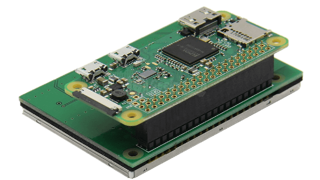

# Tiny TV

## Getting Started

- Use [raspi-config](https://www.raspberrypi.org/documentation/configuration/raspi-config.md) to:
  - Set your locale and keyboard options
  - Set up your WiFi connection
  - Set your memory allocation split to at least 128MB
- Connect your display to your Raspberry Pi and configure according to the manufacturer's instructions
- Ensure audio output is correctly configured.

---

## Installation

Installation of the program, as well as any software prerequisites, can be completed with the following two-line install script.

```
wget -q https://raw.githubusercontent.com/eat-sleep-code/tiny-tv/master/install-tiny-tv.sh -O ~/install-tiny-tv.sh
sudo chmod +x ~/install-tiny-tv.sh && ~/install-tiny-tv.sh
```

---

## Usage
```
tiny-tv <input> [options]
```

### Options

+ _--input_ : Select the video to be played    *(required, can be a file name or a Youtube URL)*
+ _--saveAs_ : Enter the name you would like the file saved as     *(Used if downloading from YouTube only)*
+ _--category_ : Select the category     *(This will set the subfolder, for example `--category cartoons` will use the `/home/pi/videos/cartoons` folder)*
+ _--maximumVideoHeight_ : Set the maximum height (in pixels) for downloaded videos     *(default: 480)*
+ _--removeVerticalBars_ : Remove the vertical black bars (pillar box) from the input file.  This time-intensive process will also resize the video to the maximum video height.   *(default: False)*
+ _--removeHorizontalBars_ : Remove the horizontal black bars (letter box) from the input file.  This time-intensive process will also resize the video to the maximum video height.    *(default: False)*
+ _--resize_ : Resize the video to the maximum video height.  This is a time-intensive process.
+ _--volume_ : Set the initial volume *(default: 400  `[4db]`)*

### Examples

#### To download, crop, and play a video from YouTube:

```
tiny-tv https://www.youtube.com/watch?v=h8NrKjJPAuw --saveAs 'Bugs Bunny.mp4' --category 'cartoons' --removeVerticalBars True 
```

The default video height is 480px.  This is an ideal resolution for a true Tiny TV.  If you are utilizing a more powerful Raspberry Pi and a higher resolution screen, you may alter the maximum video height.

```
tiny-tv https://www.youtube.com/watch?v=h8NrKjJPAuw --saveAs 'Bugs Bunny.mp4' --category 'cartoons' --maximumVideoHeight 1080
```

#### To play a music video from your Raspberry Pi at a volume of 6db:

```
tiny-tv 'Becky G - Mayores (featuring Bad Bunny).mp4' --category 'music' --volume 600
```

Alternatively, you can type the video subfolder instead of using the category argument:

```
tiny-tv 'music/Becky G - Mayores (featuring Bad Bunny).mp4' --volume 600
```
---

## Audio Settings

If you are using a USB audio device you may need to edit the `/usr/share/alsa/alsa.conf` file for audio output to function properly.  Set the following values:

```
defaults.ctl.card 1
defaults.pcm.card 1
```

## Building Your Own Tiny TV

### Bill of Materials

- 1x [Raspberry Pi Zero W](https://www.adafruit.com/product/3400) (without headers!)
- 1x [Female GPIO Header](https://smile.amazon.com/Geekworm-Stacking-Raspberry-Specifications-Extender/dp/B0827THC7R)
- 1x [iUniker 2.8" 640x480 60fps Display](https://smile.amazon.com/Raspberry-iUniker-2-8-inch-Resolution-Touchscreen/dp/B07H8ZY89H)
- 2x [90&deg; Down Angle Micro USB Plug](https://smile.amazon.com/Degree-Extension-Adapter-Charger-Adaptor/dp/B07C2K65NK) 
- 1x [Sabrent USB External Stereo Sound Adapter](https://smile.amazon.com/Sabrent-External-Adapter-Windows-AU-MMSA/dp/B00IRVQ0F8)
- 1x [90&deg; Right Angle Male Plug To Bare Open End TRS 3-Pole &#8539;"/3.5&#13212; Plug](https://smile.amazon.com/Fancasee-Replacement-Connector-Headphone-Earphone/dp/B08546Q38G)
- 2x [Adafruit Mono 2.5W Class D Audio Amplifier - PAM8302](https://www.adafruit.com/product/2130)
- 2x [Dayton Audio CE Series CE32A-8 1.25" Speaker](https://smile.amazon.com/Dayton-Audio-CE32A-8-Mini-Speaker/dp/B00BYE9AKM)
- 1x [Assorted Jumper Wires](https://smile.amazon.com/IZOKEE-Solderless-Breadboard-Arduino-Project/dp/B08151TQHG)
- 1x [Assorted Heat Shrink Tubing](https://smile.amazon.com/270-pcs-Adhesive-Assortment-MILAPEAK/dp/B0771K1Z7Q)
- 1x USB extension cable 
- Solder and soldering iron

### General Instruction for Assembly of Electronic Components

#### Before You Start
Consider your case design, some case construction steps may be inserted before, in between, or after any of the steps below as appropriate.   We constructed our case from hobby-grade walnut and basswood.   

#### The Screen and Pi
1) Remove your micro SD card from the Raspberry Pi.

2) Solder a female GPIO header to the __rear/bottom__ of the Raspberry Pi Zero W so that the Pi can be removed in the future.  Trim any excess length of the pins after soldering.

3) Connect the display and the Raspberry Pi Zero W together.



4) Replace the micro SD card and boot up the Raspberry Pi.

5) Install the software, following the manufacturer's [instructions](https://github.com/tianyoujian/MZDPI).

   ```
   cd ~/
   git clone https://github.com/tianyoujian/MZDPI.git
   cd MZDPI/vga
   sudo chmod +x mzdpi-vga-autoinstall-online
   sudo ./mzdpi-vga-autoinstall-online
   sudo reboot
   ```
6) Remove your micro SD card from the Raspberry Pi.

#### Power Leads

1) Trim the end from a red jumper wire, leaving the female end intact.  Solder the red wire to either [Pin 2 or Pin 4](https://pinout.xyz/pinout/5v_power) of the Raspberry Pi Zero.

1) Trim the end from a black jumper wire, leaving the female end intact.  Solder the black wire to [Pin 39](https://pinout.xyz/pinout/ground) of the Raspberry Pi Zero.

#### Audio Amplifiers
1) Solder the header pins _and_ speaker posts to each Audio Amplifier.

1) Create two Y jumper cables for the amplifier power and ground:   
    - Trim the end from a red jumper wire, leaving the __male__ end intact.   

    - Trim the ends from two red jumper wires, leaving the __female__ end intact.    
    
    - Solder the two red female-ended cables to the red male-ended -- forming a Y cable with two female plugs on one end and a male plug on the other end.   
    
    - Slide a length of heat shrink tubing over the solder joint and shrink it using either a torch on low heat or a heat gun.
    
    - Trim the end from a black jumper wire, leaving the __male__ end intact.   
    
    - Trim the ends from two black jumper wires, leaving the __female__ end intact.    
    
    - Solder the two black female-ended cables to the black male-ended -- forming a Y cable with two female plugs on one end and a male plug on the other end.  
    
    - Slide a length of heat shrink tubing over the solder joint and shrink it using either a torch on low heat or a heat gun.
    
1) Attach a female plug of the black Y ground jumper cable to the GND (ground) pin of __each__ audio amplifier board.

1) Attach a female plug of the red Y power jumper cable to the VIN (voltage in) pin of __each__ audio amplifier board.

#### Audio Source 
1) Create a Y audio distribution cable.
    - Trim the end of a red jumper wire, leaving the __female__ end intact.  Solder the wire end to the red wire of the 90&deg; audio plug.
    
    - Trim the end of a white jumper wire, leaving the __female__ end intact.  Solder the wire end to the white wire of the 90&deg; speaker plug.
    
    - Trim the end of two black jumper wires, leaving the __female__ ends intact.  Solder the wire ends to the ground/silver wire of the 90&deg; speaker plug, forming a Y.
    
    - Slide a piece of heat shrink tubing over each individual solder joint and shrink it.

1) Attach the female plug of the audio red wire to the A+ pin of one audio board.   

1) Attach the female plug of the audio white wire to the A+ pin of the other audio board.   

1) Attach the female plug of each audio wire to the A- pin of each audio amplifier board.  

1) Plug the &#8539;"/3.5&#13212; jack of the audio plug into the green headphone port of the USB audio adapter.   

1) Plug the USB audio adapter into one of the 90&deg; down angle micro USB cables and plug the USB cable into the center plug of the Pi Zero W.

#### Audio Output
1) Trim the end of two red jumper wires, leaving the __female__ ends intact.  Solder one red wire to the appropriate post of each speaker.

1) Trim the end of two white jumper wires, leaving the __female__ ends intact.   Solder one white wire to the appropriate post of each speaker.

1) Attach the female plug of each speaker's red wire to the + speaker post of each audio board.   

1) Attach the female plug of each speaker's white wire to the - speaker post of each audio amplifier board.   

#### Final Connections
1) Connect the male ends of the power Y adapters to the corresponding leads you soldered to the Raspberry Pi at the beginning of this guide.

2) Connect the second 90&deg; down micro USB cable to USB extension cable.

3) Connect the second 90&deg; down micro USB cable to the power outer micro USB port of the Raspberry Pi.

4) Replace the micro SD card and boot up the Raspberry Pi.

5) Connect the USB extension cable to a power source and enjoy!