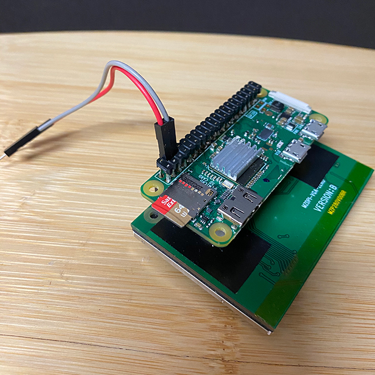
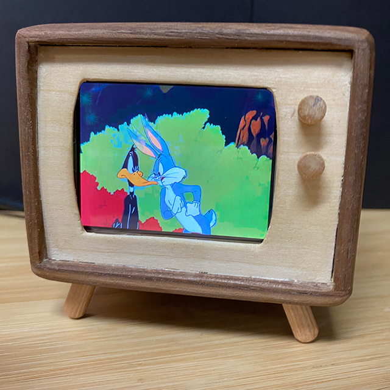

# Tiny TV

Do you remember the classic console TV's of the second half of the last century?  You know, the ones that were a piece of furniture and took up a large portion of a room?   Now you can build one that has that same classic look --  but only fills up a corner of your desk.

[](https://www.youtube.com/watch?v=es5J1oA_HFo "Tiny TV - Cartoon Example")

[](https://www.youtube.com/watch?v=-g9xvwmz9Os "Tiny TV - Music Video Example")

## Getting Started

- Use [Raspberry Pi Imager](https://www.raspberrypi.com/software) to install Raspberry Pi OS Lite *(Bookworm)* on a microSD card
- Use [raspi-config](https://www.raspberrypi.org/documentation/configuration/raspi-config.md) to:
  - Expand your filesystem
  - Set your locale and keyboard options
  - Set up your WiFi connection
  - Select your Audio device
  - Enable SSH
- Connect your display to your Raspberry Pi and configure according to the manufacturer's instructions

---

## Installation

Installation of the program, as well as any software prerequisites, can be completed with the following two-line install script.

```sh
wget -q https://raw.githubusercontent.com/eat-sleep-code/tiny-tv/master/install-tiny-tv.sh -O ~/install-tiny-tv.sh
sudo chmod +x ~/install-tiny-tv.sh && ~/install-tiny-tv.sh
```

---

## Usage
```sh
tiny-tv <input> [options]
tiny-tv-persist <input> [options]
tiny-tv-resume
tiny-tv-start # starts the service, if enabled
tiny-tv-stop # stops the service, if enabled
tiny-tv-update # reinstalls Tiny TV program
backlight [power state] #turns on or off the backlight, if supported by display
```

### Options

+ _--input_ : Select the video to be played    *(required, can be a file name, a Youtube URL, or the word 'category')*
+ _--saveAs_ : Enter the name you would like the file saved as     *(Used if downloading from YouTube only)*
+ _--category_ : Select the category     *(This will set the subfolder, for example `--category cartoons` will use the `/home/pi/videos/cartoons` folder)*
+ _--maximumVideoHeight_ : Set the maximum height (in pixels) for downloaded videos     *(default: 480)*
+ _--removeVerticalBars_ : Remove the vertical black bars (pillar box) from the input file.  This time-intensive process will also resize the video to the maximum video height.   *(default: False)*
+ _--removeHorizontalBars_ : Remove the horizontal black bars (letter box) from the input file.  This time-intensive process will also resize the video to the maximum video height.    *(default: False)*
+ _--resize_ : Resize the video to the maximum video height.  This is a time-intensive process.
+ _--volume_ : Set the initial volume percent *(default: 100, min: 0, max: 100`)*
+ _--loop_ : Set whether video plays continuously in a loop *(default: True)*
+ _--shuffle_ : Set whether category-based playback is shuffled *(default: False)*

---

### Playback Controls

You can control the device from either a Bluetooth keyboard or via an SSH connection from another machine.   

|Key|Action|
|---|---|
| - | Decrease volume <em> (in increments of 5%)</em> |
| + | Increase volume <em> (in increments of 5%)</em> |
| Space | Pause/Resume |
| q | Exit |
| Left | Restart current video |
| Right | Advanced to next video |


---

### Examples

#### To download, crop, and play a video from YouTube:

```sh
tiny-tv https://www.youtube.com/watch?v=h8NrKjJPAuw --saveAs 'Bugs Bunny.mp4' --category 'cartoons' --removeVerticalBars True 
```

The default video height is 480px.  This is an ideal resolution for a true Tiny TV.  If you are utilizing a more powerful Raspberry Pi and a higher resolution screen, you may alter the maximum video height.

```sh
tiny-tv https://www.youtube.com/watch?v=h8NrKjJPAuw --saveAs 'Bugs Bunny.mp4' --category 'cartoons' --maximumVideoHeight 1080
```

#### To play a music video from your Raspberry Pi at a volume of 30%:

```sh
tiny-tv 'Becky G - Mayores (featuring Bad Bunny).mp4' --category 'music' --volume 30
```

Alternatively, you can type the video subfolder instead of using the category argument:

```sh
tiny-tv 'music/Becky G - Mayores (featuring Bad Bunny).mp4' --volume 10
```

#### To play all the cartoons in a loop:

```sh
tiny-tv 'category' --category 'cartoons' --volume 50
```

#### Keep Tiny TV playing even after SSH session ends

```sh
tiny-tv-persist 'category' --category 'christmas' --volume 50
```
After the video begins playing, you may:
1) Press __Ctrl-A__.
1) Press __Ctrl-D__.
1) Disconnect from your SSH session.

To reconnect to the existing playback, you may:
1) Connect via SSH
1) Type `tiny-tv-resume`

---

## Audio Settings

If you are using a USB audio device, you _may_ need to edit the `/usr/share/alsa/alsa.conf` file for audio output to function properly.  Set the following values:

```sh
defaults.ctl.card 1
defaults.pcm.card 1
```
---

## Autostart Tiny TV
Want to start the Tiny TV program every time you boot your Raspberry Pi?  Here is how!

### Via *.profile* file
* Add a line to the very end of ~/.profile such as `tiny-tv 'category' --category 'cartoons'` and save the changes to the file.
* Restart the Tiny TV.
*Note that this method avoids many permissions issue which may arise when attemptint to use the **systemd** method below.   However, it will attempt to start the Tiny TV program every time you login to via SSH, etc.   You may need to press CTRL-C to abort the loading of the application in these instances.*

### Via systemd:
* Review `/etc/systemd/system/tiny-tv.service`
   * If you would like to add any of aforementioned options you may do so by editing the service file.
* Run `~/tiny-tv/install-tiny-tv.service.sh`

---


## Building Your Own Tiny TV (Legacy Design)

*Stay tuned for an upgraded build guide for our current version of the Tiny TV.*

### Bill of Materials

- 1x [Raspberry Pi Zero W](https://www.adafruit.com/product/3400)
  - Do not purchase a Raspberry Pi Zero (non-W) &ndash; you need the wireless connectivity.
  - If using the iUniker display, do not purchase a Raspberry Pi Zero WH &ndash; the headers it includes are the incorrect type and position.   
- 1x [Female GPIO Header](https://amazon.com/Geekworm-Stacking-Raspberry-Specifications-Extender/dp/B0827THC7R)
- 1x [iUniker 2.8" 640x480 60fps Display](https://amazon.com/Raspberry-iUniker-2-8-inch-Resolution-Touchscreen/dp/B07H8ZY89H)
- 2x [90&deg; Down Angle Micro USB Plug](https://amazon.com/Degree-Extension-Adapter-Charger-Adaptor/dp/B07C2K65NK) 
- 1x [Sabrent USB External Stereo Sound Adapter](https://amazon.com/Sabrent-External-Adapter-Windows-AU-MMSA/dp/B00IRVQ0F8)
- 1x [90&deg; Right Angle Male Plug To Bare Open End TRS 3-Pole &#8539;"/3.5&#13212; Plug](https://amazon.com/Fancasee-Replacement-Connector-Headphone-Earphone/dp/B08546Q38G)
- 2x [Adafruit Mono 2.5W Class D Audio Amplifier - PAM8302](https://www.adafruit.com/product/2130)
- 2x [Dayton Audio CE Series CE32A-8 1.25" Speaker](https://amazon.com/Dayton-Audio-CE32A-8-Mini-Speaker/dp/B00BYE9AKM)
- 1x [Assorted Jumper Wires](https://amazon.com/IZOKEE-Solderless-Breadboard-Arduino-Project/dp/B08151TQHG)
- 1x [Assorted Heat Shrink Tubing](https://amazon.com/270-pcs-Adhesive-Assortment-MILAPEAK/dp/B0771K1Z7Q)
- 1x USB extension cable 
- Solder and soldering iron

### General Instruction for Assembly of Electronic Components

#### Before You Start
Consider your case design, some case construction steps may be inserted before, in between, or after any of the steps below as appropriate.   We constructed our case from hobby-grade walnut and basswood.   

#### The Screen and Pi

1) Complete the steps outlined in the [Getting Started](#getting-started) section.

1) Install the software as outlined in the [Installation](#installation) section.

1) Remove your micro SD card from the Raspberry Pi.   The heat from soldering the adjacent GPIO header can potentially damage the SD card.

1) Solder a female GPIO header to the __rear/bottom__ of the Raspberry Pi Zero W so that the Pi can be removed in the future.  

1) Connect the display and the Raspberry Pi Zero W together.




1) Replace the micro SD card and boot up the Raspberry Pi.

1) Install the software, following the manufacturer's [instructions](https://github.com/tianyoujian/MZDPI).

   ```sh
   cd ~/
   git clone https://github.com/tianyoujian/MZDPI.git
   cd MZDPI/vga
   sudo chmod +x mzdpi-vga-autoinstall-online
   sudo ./mzdpi-vga-autoinstall-online
   sudo reboot
   ```
1) Remove your micro SD card from the Raspberry Pi.

#### Power Leads

If the header pins of your female GPIO header are too short you will need solder the power leads for the amplifiers directly to the GPIO pins:  

  1) Trim the end from a red jumper wire, leaving the female end intact.  Solder the red wire to either [Pin 2 or Pin 4](https://pinout.xyz/pinout/5v_power) of the Raspberry Pi Zero.
    
  1) Trim the end from a black jumper wire, leaving the female end intact.  Solder the black wire to [Pin 39](https://pinout.xyz/pinout/ground) of the Raspberry Pi Zero.

#### Audio Amplifiers
1) Solder the header pins _and_ speaker posts to each Audio Amplifier.

1) Create two Y jumper cables for the amplifier power and ground:   
    - Trim the end from a red jumper wire, leaving the __male__ end intact.   

    - Trim the ends from two red jumper wires, leaving the __female__ end intact.    
    
    - Solder the two red female-ended cables to the red male-ended -- forming a Y cable with two female plugs on one end and a male plug on the other end.   
    
    - Slide a length of heat shrink tubing over the solder joint and shrink it using either a torch on low heat or a heat gun.
    
    - Trim the end from a black jumper wire, leaving the __male__ end intact.   
    
    - Trim the ends from two black jumper wires, leaving the __female__ end intact.    
    
    - Solder the two black female-ended cables to the black male-ended -- forming a Y cable with two female plugs on one end and a male plug on the other end.  
    
    - Slide a length of heat shrink tubing over the solder joint and shrink it using either a torch on low heat or a heat gun.
    


    
1) Attach a female plug of the black Y ground jumper cable to the GND (ground) pin of __each__ audio amplifier board.

1) Attach a female plug of the red Y power jumper cable to the VIN (voltage in) pin of __each__ audio amplifier board.

#### Audio Source 
1) Create a Y audio distribution cable.
    - Trim the end of a red jumper wire, leaving the __female__ end intact.  Solder the wire end to the red wire of the 90&deg; audio plug.
    
    - Trim the end of a white jumper wire, leaving the __female__ end intact.  Solder the wire end to the white wire of the 90&deg; speaker plug.
    
    - Trim the end of two black jumper wires, leaving the __female__ ends intact.  Solder the wire ends to the ground/silver wire of the 90&deg; speaker plug, forming a Y.
    
    - Slide a piece of heat shrink tubing over each individual solder joint and shrink it.

1) Attach the female plug of the audio red wire to the A+ pin of one audio board.   

1) Attach the female plug of the audio white wire to the A+ pin of the other audio board.   

1) Attach the female plug of each audio wire to the A- pin of each audio amplifier board.  

1) Plug the &#8539;"/3.5&#13212; jack of the audio plug into the green headphone port of the USB audio adapter.   

1) Plug the USB audio adapter into one of the 90&deg; down angle micro USB cables and plug the USB cable into the center plug of the Pi Zero W.

#### Audio Output


1) Trim the end of two red jumper wires, leaving the __female__ ends intact.  Solder one red wire to the appropriate post of each speaker.

1) Trim the end of two white jumper wires, leaving the __female__ ends intact.   Solder one white wire to the appropriate post of each speaker.

1) Attach the female plug of each speaker's red wire to the + speaker post of each audio board.   

1) Attach the female plug of each speaker's white wire to the - speaker post of each audio amplifier board.   

#### Making Connections


1) Connect the male ends of the power Y adapters to the corresponding leads you soldered to the Raspberry Pi at the beginning of this guide.

2) Connect the second 90&deg; down micro USB cable to USB extension cable.

3) Connect the second 90&deg; down micro USB cable to the power outer micro USB port of the Raspberry Pi.

4) Replace the micro SD card and boot up the Raspberry Pi.

5) Connect the USB extension cable to a power source and test the device.


#### Final Assembly

The case design is up to you.   Below are a few images of our design for inspiration.


Finish assembling your case and put your Tiny TV to use.   




## Just the FAQs, ma'am
### How big is it?   

  - Maybe you should ask, "how tiny is it?".  Our design is ridiculously small at just 3.75" x 3.75" x 3.25" (95.25mm x 95.25mm x 82.55mm).   An iPhone will take up more room on your desk.

### Does it just play video?

  - No, it plays sound too!   As outlined above, there are two discrete audio amplifiers powering two 1.25" (32mm) speakers.   

  - If you install Raspberry Pi OS desktop edition, you could use it as a ridiculously small desktop computer.   
